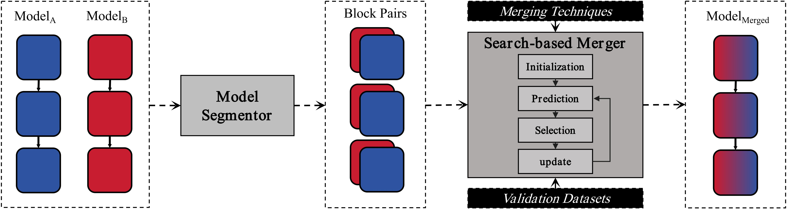

# AutoMerge: Search-Based Model Merging Framework for Effective Model Reuse



This repository contains code for the paper AutoMerge: Search-Based Model Merging Framework for Effective Model Reuse. This work conducts a systematic study of model merging techniques across diverse model architectures and domains, revealing critical limitations that hinder their effectiveness for model reuse, and propose a novel search-based model merging framework that merges multiple task-specific source models to obtain a multi-task model through a training-free approach.

---

## 1. Virtual Environment Setup

This project requires multiple environments. It is recommended to use **conda** or **venv** for environment management.  

### 1.1 AutoMerge Environment

The AutoMerge environment is created from `requirements.txt`:

```bash
conda create -n AutoMerge python=3.10
conda activate AutoMerge
pip install -r requirements.txt
```

### 1.2 InterFuser Environment

Navigate to the `InterFuser/` directory and follow its `README.md` for environment setup:

```bash
cd InterFuser
# Follow the instructions in InterFuser/README.md
```

To conduct testing in the CARLA simulation environment, we also need to configure the CARLA environment. Download and setup CARLA 0.9.10.1

```Shell
chmod +x setup_carla.sh
./setup_carla.sh
easy_install carla/PythonAPI/carla/dist/carla-0.9.10-py3.7-linux-x86_64.egg
```

### 1.3 CCT Environment

Navigate to the `Compact-Transformers/` directory and follow its `README.md` for environment setup:

```bash
cd Compact-Transformers
# Follow the instructions in Compact-Transformers/README.md
```

---

## 2. Using mergekit

`mergekit` is a tool for merging models. This repository supports merging both Hugging Face models and local PyTorch models.

### 2.1 Merging Models from Hugging Face

1. Make sure the `AutoMerge` environment is active.  
2. Run the following command to merge two or more Hugging Face models:

```bash
mergekit-yaml example_hf_merge.yml --out-dir merged_model
```

- `example_hf_merge.yml` defines the models and merge strategy.  
- `--out-dir` specifies the output directory for the merged model.  

### 2.2 Merging Local PyTorch Models

1. Specify the paths of local PyTorch models in a YAML file.  
2. Run:

```bash
mergekit-pytorch example_local_merge.yml --out-dir merged_model
```

- The `model_paths` field in the YAML supports local directories.  
- The merged weights will be saved under the specified output directory.  

> For more advanced options, please check the [mergekit documentation](https://github.com/arcee-ai/mergekit).

---

## 3. Training Source Models

This repository contains **InterFuser** and **Compact-Transformers (CCT)** directories, which can be used to train custom source models.

### 3.1 InterFuser

Navigate to the `InterFuser/` directory and follow its `README.md` for data preparation and training:

```bash
cd InterFuser
# See README.md for detailed training commands
```

The trained model weights can later be merged using mergekit.

### 3.2 Compact-Transformers (CCT)

Navigate to the `Compact-Transformers/` directory and follow its `README.md` for training:

```bash
cd Compact-Transformers
# See README.md for detailed training commands
```

The resulting CCT models can also be used as source models for mergekit.

---

## 4. Project Structure (Simplified)

```plaintext
AutoMerge/
├── requirements.txt        # Dependencies for AutoMerge environment
├── InterFuser/             # InterFuser source code and training scripts
│   └── README.md
├── Compact-Transformers/   # Compact-Transformers source code and training scripts
│   └── README.md
├── merged_model/           # Output directory for merged models
└── ...
```

---

## 5. Acknowledgments

- [mergekit](https://github.com/arcee-ai/mergekit)  
- [InterFuser](https://github.com/opendilab/InterFuser)  
- [Compact-Transformers](https://github.com/SHI-Labs/Compact-Transformers)  
